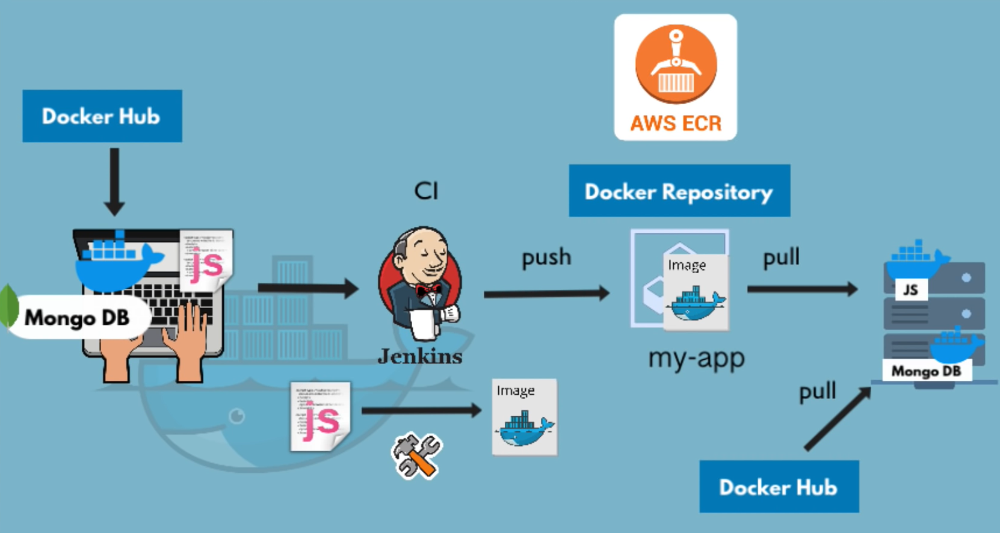

# Docker project

## Complete development workflow of an APP with Docker, Jenkins and AWS

 

  

# Index

1. [Project title](#complete-development-workflow-of-an-app-with-docker-jenkins-and-aws)

2. [Project description](#project-description)

3. [Technologies and Tools used](#technologies-and-tools-used)

4. [Project Setup](#project-setup)

5. [Project status](#project-status)

6. [Contribution](#contribution)

7. [Project developer](#project-developer)

 

## Project description

    ✔️ Development of a basic APP using NodeJS, ExpressJS and JavaScript,
    containerizing it through the use of Docker containers.

    ✔️ Creation of a Docker network where a MongoDB container and another one with MongoExpress
    (MongoDB graphical interface) communicate with each other.

    ✔️ Adjustment of the configuration in MongoExpress to enhance the visualization and updating of data.

    ✔️ Using the Dockerfile, we manually simulate the Jenkins process to package and compile
    the artifact of a new version of the APP into a Docker Image.

    ✔️ Using AWS CLI, the Image is deployed to a private repository in AWS ECR
    (Elastic Container Registry).

    ✔️ By using Docker Compose, the Image is extracted from the private AWS repository,
    thereby allowing accessibility to the development server and facilitating access to the APP.

 

## Technologies and Tools used

   
  
  
  
   
   
  
  
  
   
   
  
  
  

 

## Project Setup

### To start the application

 

Step 1: Create docker network

    docker network create mongo-network

Step 2: start mongodb. Use your own environment variables.

    docker run -d -p 27017:27017 -e MONGO_INITDB_ROOT_USERNAME=${MONGO_INITDB_ROOT_USERNAME} -e MONGO_INITDB_ROOT_PASSWORD=${MONGO_INIT_ROOT_PASSWORD} --name mongodb --net mongo-network mongo

Step 3: start mongo-express. Use your own environment variables.

    docker run -d -p 8081:8081 -e ME_CONFIG_MONGODB_ADMINUSERNAME=${ME_CONFIG_MONGODB_ADMINUSERNAME} -e ME_CONFIG_MONGODB_ADMINPASSWORD=${ME_CONFIG_MONGODB_ADMINPASSWORD} --net mongo-network --name mongo-express -e ME_CONFIG_MONGODB_SERVER=${ME_CONFIG_MONGODB_ADMINMONGODBSERVER} mongo-express

_NOTE: creating docker-network in optional. You can start both containers in a default network. In this case, just emit `--net` flag in `docker run` command_

Step 4: open mongo-express from browser

    http://localhost:8081

Step 5: create `user-account` _db_ and `users` _collection_ in mongo-express

Step 6: Start your NodeJS application locally - go to `app` directory of project

    npm install
    node server.cjs

Step 7: Access you NodeJS application UI from browser

    http://localhost:3000

 

### With Docker Compose

#### To start the application

 

Step 1: start mongodb and mongo-express

    docker-compose -f docker-compose.yaml up

_You can access the mongo-express under localhost:8080 from your browser_

Step 2: in mongo-express UI - create a new database "my-db"

Step 3: in mongo-express UI - create a new collection "users" in the database "my-db"

Step 4: start node server

    npm install
    node server.cjs

Step 5: access the NodeJS application from browser

    http://localhost:3000

#### To build a Docker Image from the application

    docker build -t docker-project:1.0 .

_NOTE: The dot "." at the end of the command denotes location of the Dockerfile._

 

## Project status

 

 

## Contribution

If you want to contribute to this project, follow these steps:

1. Perform a fork to the repository.

2. Create a branch for your feature or bugfix: `git checkout -b feature/your-feature-name`

3. Make the necessary changes and commits:  `git commit -m 'Add some feature'`

4. Push to branch: `git push origin feature/your-feature-name`

5. Send a pull request to the original repository.

 

## Project developer

 

| [ Kevin Schans](https://github.com/KevinVanDerSchans) |
:------------------------------------------------------------------------------------------------------------------------------------------: |
